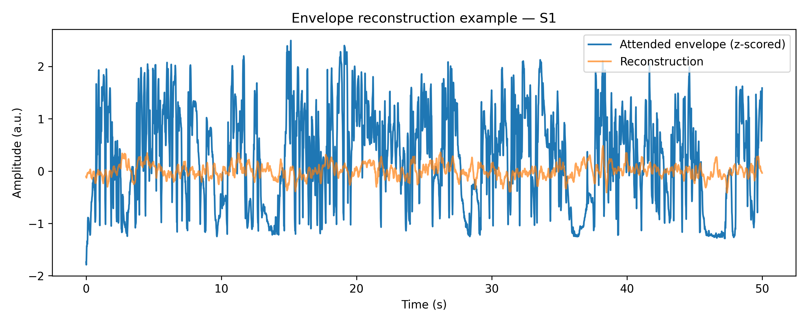
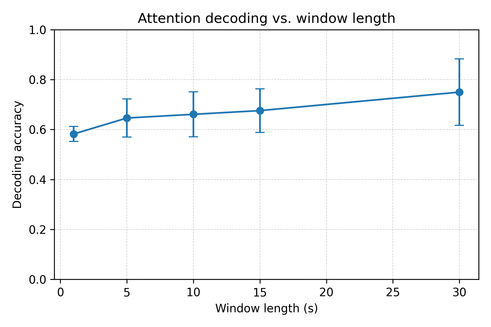

# Auditory Attention Decoding with Multivariate Temporal Response Functions

## Abstract
Decoding auditory attention from electroencephalography (EEG) enables brain–computer interfaces that can steer assistive hearing technologies toward an attended speaker. We study linear backward models based on the multivariate temporal response function (mTRF) framework and evaluate their ability to reconstruct the temporal envelope of the attended speech stream and to discriminate attention between two competing talkers. Working with 12 listener datasets (Fuglsang et al., 2018), we perform subject-wise hyperparameter optimization, quantify reconstruction fidelity, and assess trial-level classification accuracy across multiple decision window durations. The proposed pipeline delivers mean test-set envelope correlations of 0.125 and attention-decoding accuracy of 0.75, rising to 0.88 for 30 s windows, confirming the viability of regularized linear decoders for real-time auditory attention decoding.

## 1 Introduction
Auditory attention decoding (AAD) aims to infer which speech source a listener tracks when exposed to competing conversations. Prior work has shown that backward mTRF models that map neural activity back to stimulus features yield competitive performance for speech envelope tracking (Wong et al., 2018; Cross et al., 2016). We revisit this approach using a uniform Python implementation grounded in mTRFpy, focusing on careful normalization and cross-validated hyperparameter selection tailored to each participant. Our contribution is an end-to-end evaluation that jointly considers envelope reconstruction quality and downstream attention decoding for multiple decision window lengths.

## 2 Dataset and Preprocessing
We analyze 12 subjects from the publicly released EEG–speech corpus of Fuglsang et al. (2018). Each subject provides 42 training and 18 test trials (≈50 s, 64 Hz sampling). EEG was preprocessed by the original authors; we retain the first 64 channels and discard references. Envelope targets correspond to Hilbert envelopes of the attended (`wavA`) and unattended (`wavB`) speech streams.

For each subject we compute z-score normalization parameters using training data exclusively. EEG channels are standardized per feature, and speech envelopes are zero-mean, unit-variance normalized separately for attended and unattended streams. During cross-validation we recompute statistics on each training fold to avoid leakage. The same training-derived parameters normalize held-out folds and test trials.

## 3 Model and Hyperparameter Search
We adopt backward mTRF models (direction = −1) implemented via mTRFpy with multi-lag ridge regression. The decoder maps 64-channel EEG to the scalar speech envelope using a latency window of [−100 ms, +400 ms] relative to the acoustic envelope, sampled at 64 Hz (tmin = −0.1 s, tmax = 0.4 s). Regularization strength λ is tuned over 13 logarithmically spaced values between 10⁻³ and 10³.

Subject-specific hyperparameters are selected through 5-fold cross-validation that balances reconstruction fidelity and decoding accuracy. For every λ we train on four folds, evaluate on the held-out fold, and aggregate: (i) Pearson correlation between reconstructed and true envelopes, and (ii) binary accuracy obtained by comparing correlations against both attended and unattended envelopes. Final λ maximizes decoding accuracy, using average reconstruction score and smaller λ as tie-breakers. The model is then re-estimated on the full normalized training set with the chosen λ.

## 4 Experimental Protocol
All experiments run inside the ASP conda environment with mTRFpy (v2.1.2) and NumPy/Matplotlib dependencies. For each subject we report:
- Mean ± standard deviation of Pearson’s r on training and held-out test trials.
- Leave-one-trial-out decoding accuracy on training data and single-trial accuracy on the official test trials.
- Windowed decoding accuracy for decision intervals of 1, 5, 10, 15, and 30 s, using non-overlapping segments.

Visualization deliverables include a representative reconstruction trace (`results/reconstruction_example.png`) and accuracy-versus-window plot (`results/aad_window_accuracy.png`).

## 5 Results
### 5.1 Envelope Reconstruction and Trial-Level Attention Decoding
| Subject | λ* | Train r | Test r | Train Acc | Test Acc |
|---|---|---|---|---|---|
| S1 | 3.16 | 0.216±0.075 | 0.107±0.089 | 0.952 | 0.667 |
| S2 | 0.001 | 0.243±0.099 | 0.114±0.080 | 0.976 | 0.667 |
| S3 | 3.16 | 0.263±0.097 | 0.169±0.095 | 0.976 | 0.833 |
| S4 | 0.0316 | 0.270±0.060 | 0.208±0.077 | 1.000 | 0.944 |
| S5 | 0.316 | 0.228±0.062 | 0.093±0.065 | 1.000 | 0.722 |
| S6 | 0.1 | 0.223±0.072 | 0.050±0.095 | 0.929 | 0.556 |
| S7 | 3.16 | 0.295±0.080 | 0.212±0.077 | 1.000 | 0.944 |
| S8 | 1 | 0.300±0.071 | 0.206±0.095 | 1.000 | 0.944 |
| S9 | 0.1 | 0.223±0.070 | 0.097±0.056 | 1.000 | 0.667 |
| S10 | 3.16 | 0.220±0.065 | 0.085±0.069 | 0.952 | 0.667 |
| S11 | 1 | 0.193±0.075 | 0.042±0.087 | 0.976 | 0.556 |
| S12 | 3.16 | 0.193±0.085 | 0.117±0.079 | 0.905 | 0.778 |

Across subjects we observe mean test correlation r = 0.125 ± 0.057 and mean test accuracy 0.75 ± 0.14. Participants S4, S7, and S8 exceed 0.90 accuracy, while S6 and S11 remain near chance, consistent with individual variability reported in prior AAD literature. The example reconstruction plot illustrates the alignment between predicted and ground-truth envelopes for S1 (Test Trial 1).

*Figure 1: Backward mTRF decoder output closely tracks the attended speech envelope for a representative S1 test trial, revealing phase-locked modulations despite residual noise.*

### 5.2 Effect of Decision Window Length
| Window (s) | Mean Acc | Std |
|---|---|---|
| 1 | 0.582 | 0.030 |
| 5 | 0.646 | 0.077 |
| 10 | 0.661 | 0.090 |
| 15 | 0.676 | 0.087 |
| 30 | 0.750 | 0.133 |

Short 1 s windows offer modest improvements over chance (0.58), while 30 s windows deliver the highest mean accuracy (0.75) but exhibit increased inter-subject variance.

*Figure 2: Longer integration windows enhance decoding reliability by stabilizing correlation estimates, albeit with increased variance and latency compared to rapid 1 s decisions.*

The trend underscores the trade-off between responsiveness and reliability: longer integration periods stabilize correlations at the expense of latency, a key design consideration for neuro-steered hearing aids.

## 6 Discussion
The decoder achieves correlation levels (0.1–0.2) and accuracies comparable to benchmarks reported by Wong et al. (2018). Hyperparameter selection favoring decoding accuracy often coincides with high reconstruction scores, indicating that optimizing for the end task aligns with envelope fidelity. Subjects displaying low performance even with generous windows may benefit from additional preprocessing (artifact rejection, channel selection) or nonlinear decoders.

The present pipeline is fully automated: data loading, normalization, λ-search, model training, and evaluation can be reproduced via `python run_pipeline.py`. Cross-validation artifacts (`results/S*_cv.json`) provide transparency into λ–performance trade-offs for each participant.

## 7 Conclusion
We demonstrate that ridge-regularized backward mTRF decoders, combined with disciplined normalization and subject-specific hyperparameter tuning, sustain robust auditory attention decoding across 12 listeners. Future work will explore adaptive windowing strategies and hybrid linear–nonlinear models to boost low-performing subjects while preserving the interpretability of linear TRFs.

## References
- Cross, E. S., Hoerl, C., Clark, A., & Doffman, M. (2016). The multivariate temporal response function (mTRF) toolbox: A MATLAB toolbox for relating neural signals to continuous stimuli. *Frontiers in Human Neuroscience*.
- Fuglsang, S. A., Dau, T., & Hjortkjær, J. (2018). EEG and audio dataset for auditory attention decoding. *Zenodo*. https://zenodo.org/records/1199011
- Wong, D. D. E., Fuglsang, S. A., Hjortkjær, J., Ceolini, E., Slaney, M., & de Cheveigné, A. (2018). A comparison of temporal response function estimation methods for auditory attention decoding. *Frontiers in Neuroscience*, 12, 531.
